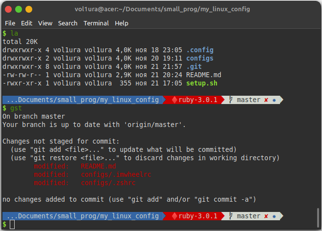

# Useful programs and configs

* [Pyenv usage on Linux](pyenv.md)
* [Chromedriver installation on Linux](install_chromedriver.md)

## IMWheel for remapping keyboard and mouse buttons

Install
```shell
sudo apt install imwheel
```

Copy `.imwheel` to home directory and add it to auto load.

See also https://wiki.archlinux.org/title/IMWheel

## Zsh and Oh-my-zsh

### 1. Install zsh

```shell
sudo apt install zsh
sudo chsh -s /bin/zsh
```

### 2. Install oh-my-zsh

```shell
sh -c "$(curl -fsSL https://raw.github.com/ohmyzsh/ohmyzsh/master/tools/install.sh)"
```

### 3. Add plugins `zsh-syntax-highlighting` and `zsh-autosuggestions`

```shell
git clone https://github.com/zsh-users/zsh-syntax-highlighting.git ${ZSH_CUSTOM:-~/.oh-my-zsh/custom}/plugins/zsh-syntax-highlighting
git clone https://github.com/zsh-users/zsh-autosuggestions ${ZSH_CUSTOM:-~/.oh-my-zsh/custom}/plugins/zsh-autosuggestions
```

### 4. Configure `~/.zshrc` - see my config file.

Here is my plugins set:

```
plugins=(git docker docker-compose zsh-syntax-highlighting zsh-autosuggestions rails rvm virtualenv command-not-found copybuffer)
```

### 5. Configure custom theme

I use customized https://github.com/caiogondim/bullet-train.zsh - see my config `configs/bullet-train.zsh-theme`



## RClone to handle cloud disks

See official documentation https://rclone.org/install/

```shell
curl https://rclone.org/install.sh | sudo bash
rclone config
```

1. Edit and copy file `configs/rclone@.service` to `/lib/systemd/system`.

2. You need also to create a remote on RClone and a folder on your disk, both with same name <rclone-remote>.

3. Register new service by typing:

```shell
sudo systemctl daemon-reload
```
4. Do the next one for every remote you want to load on boot

```shell
sudo systemctl enable rclone@<rclone-remote>.service
sudo systemctl start rclone@<rclone-remote>.service
```

5. Check service

```shell
sudo systemctl status rclone@<rclone-remote>.service
```

My shell scripts runs Yandex.Disk and OneDrive.

## Vim distribution

I use Janus: https://github.com/carlhuda/janus

## Midnight commander

```shell
sudo apt install mc
select-editor
```

## fstab

Edit `configs/fstab` and copy it to `/etc/fstab`

```shell
sudo cp ./configs/fstab /etc/fstab
sudo mount -av
```

## Cinnamon desktop customization

https://www.youtube.com/watch?v=DMs7DX3Um9E

1. Mac Big Sur wallpaper packs: https://www.pling.com/p/1400125

2. Install Gtk Theme - Whitesur Gtk Theme Light/Dark
https://github.com/vinceliuice/WhiteSur-gtk-theme

3. Install Icons Theme - Whitesur Icon Theme Light/Dark
https://github.com/vinceliuice/WhiteSur-icon-theme

4. Install Cursors Theme - McMojave Cursors
https://github.com/vinceliuice/McMojave-cursors

5. Configure Panel And Applets

6. Install And Configure Plank Dock `sudo apt install plank`

Theme plank: https://github.com/vinceliuice/WhiteSur-gtk-theme

7. Install And Configure Albert Launcher

Download: https://software.opensuse.org/download.html?project=home%3Amanuelschneid3r&package=albert

Theme: https://store.kde.org/p/1410038/
